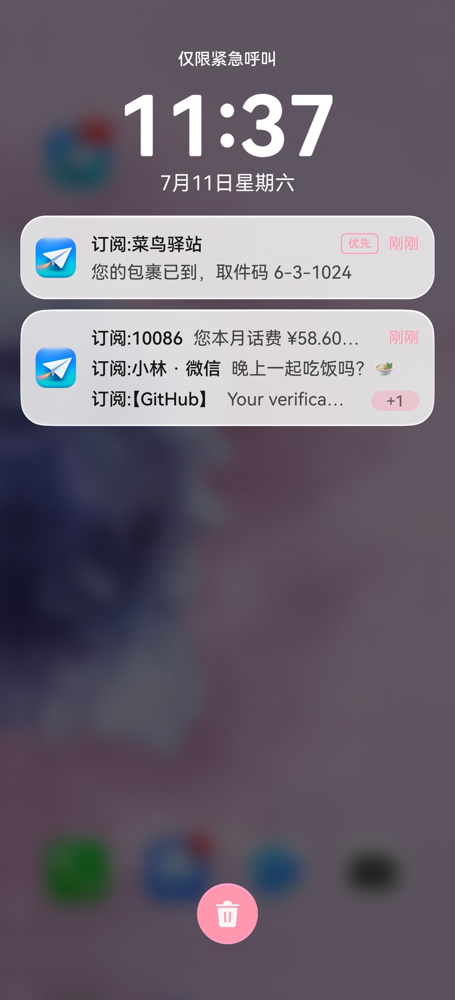
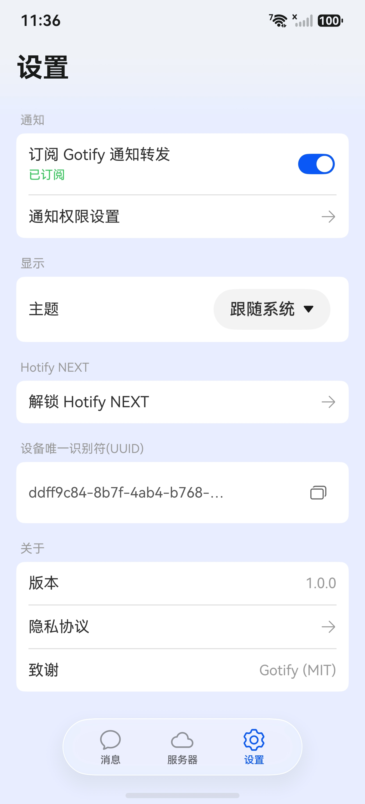

# Hotify Server

**一条 curl，把消息送到你的所有设备**——鸿蒙手机系统级锁屏推送、iPhone（复用 Bark 生态）、任何 WebSocket 客户端。**兼容 bark / gotify / ntfy 三套协议**，SmsForwarder、Uptime Kuma、Home Assistant 等现有工具改个地址就能用。**数据全保存在你自己的服务器上**——单二进制、内嵌数据库、零外部依赖。

> **源码暂未开源**（后续将以开源许可证发布）；本仓发行物——二进制、容器镜像、部署脚本——公开可用。
> **Gitee 为主要下载渠道**（国内可达优先；GitHub 为镜像）。

<p align="left">
  
  
</p>

## 特性

- **一条 HTTP 推送到所有设备**：原生 JSON API，兼容 **bark / gotify / ntfy** 三套协议入口——SmsForwarder、Uptime Kuma、Home Assistant 等现有工具改个地址即可接入（见[下方专章](#兼容-bark--gotify--ntfy-生态)）
- **离线也收得到**：鸿蒙设备经华为系统级推送通道，锁屏可达、应用进程被终止仍可送达，不依赖 FCM、不用常驻后台；iPhone 安装 Bark App 填本服务器地址即可收离线推送
- **在线实时收发**：WebSocket 毫秒级投递，断线自动增量补漏；与离线推送两路互补、按消息 id 去重，不丢不重
- **多设备消息中枢**：广播 / 定向 / `phone@pad` 式私聊地址；消息、图片与文件设备间互发，换机或重装后身份自动恢复、历史消息仍保留，多端阅读进度同步
- **媒体直传**：图片 / 音频 / 视频 / 文件走同一推送接口上传，单次默认上限 4GiB、全程流式，附件支持断点续传；配置 `external_url` 后，bark / gotify 客户端的通知也能直接显示图片（单图消息）
- **网页管理台**：`/setup` 浏览器完成初始化；`/console` 管理设备、浏览消息附件文件、在线整库备份
- **不停机整库备份**：一条 `curl` 命令导出事务一致快照，cron 定时拉取即可；数据全在一个目录，备份与迁移只需拷贝该目录，存储超限自动淘汰最旧内容
- **部署简单、国内可达**：Docker 双架构一键脚本（阿里云镜像直连）、Windows 单文件 exe 或 6 平台二进制；通知内容不经过第三方中继，自托管无消息量限额

## 快速开始

### Docker · 一键（推荐）

```bash
curl -fsSL https://gitee.com/sakura-lolipop/HotifyNEXT-Server-Release/raw/main/install.sh | bash
# 或 clone 本仓后执行 ./install.sh
```

脚本自动完成：环境检测 → 拉取镜像 → 生成 compose → 启动容器 → 健康检查。

### Docker · 手动

```bash
# 启动容器（本仓自带 docker-compose.yml，改 environment: 块后执行）
docker compose up -d

# 健康检查（默认无证书 = HTTP；配了 CERT_FILE 后改用 https）
curl http://localhost:8443/ping
# → {"code":200,"message":"pong"}
```

### 二进制（Windows x64）

从 Release 下载 exe（`hotify-server-<版本>-windows-amd64.exe`）+ `checksums.txt` 校验，同目录放 `config.yaml`（由 `config.example.yaml` 复制改名）后直接运行——三步细节与常驻方式见 [DEPLOY.md](DEPLOY.md) 路线 B。

完整指南（TLS / 反代 / 持久化 / 备份）见 **[DEPLOY.md](DEPLOY.md)**。发送第一条消息 → 见下方「API 快速参考」与「兼容 bark / gotify 生态」。

## API 快速参考

**首次使用**：浏览器打开 `https://your-domain.example/setup` 设置并获取 `your_key1`（或首台设备注册时自动生成，见 [API.md](API.md)）。

Base URL 以下记为 `https://your-domain.example`（未配证书时为 `http://<主机>:8443`）。两种凭证：

- **`your_key1`** —— 主凭证，走 `Authorization: Bearer` 头，用于本节及 [API.md](API.md) 的全部 `/api/v1/*` 接口。首台设备注册时生成。
- **`your_device_uuid`** —— 单台设备的标识，用在 bark / gotify 兼容入口（见下一节）。

### 发送一条消息（主接口）

```bash
curl -X POST https://your-domain.example/api/v1/push \
  -H 'Authorization: Bearer your_key1' \
  -H 'Content-Type: application/json' \
  -d '{"title":"服务器告警","body":"CPU 95%","url":"https://example.com/dashboard"}'
```

- `title` / `body` 至少填一个；`url`（点击跳转）、`image_url`（通知大图）可选
- 响应中的 `hlc` 是这条消息的 id（字符串），可用于后续删除、翻页
- 带图片 / 文件附件：同一接口改用 `multipart/form-data`，见 [API.md](API.md)
- ⚠️ `code:200` 不等于推送成功——`message` 含 `saved but push failed` 表示消息已保存但离线推送失败，脚本请检查 `message` 字段

### 拉取历史 / 探活

```bash
# 最近消息（?limit=1..200；?before=<消息id> 向更早翻页）
curl -H 'Authorization: Bearer your_key1' \
  'https://your-domain.example/api/v1/messages?limit=50'

# 版本与存活探活（公开，无需凭证）
curl https://your-domain.example/api/v1/info
```

### 无需自己写代码

下一节介绍如何让现成的 bark / gotify 工具直接向本服务器推送。

完整接口（设备注册与管理、媒体上传与取回、WebSocket 实时通道、备份、错误码表）见 **[API.md](API.md)**。

## 兼容 bark / gotify / ntfy 生态

Hotify 在端点级实现了 bark、gotify 与 ntfy 三套推送协议。这意味着：**这些生态里现成的 App、脚本和通知集成，把地址换成你的 Hotify 服务器就能用。**（推送地址可设置短别名，如 `https://server/pad/标题/正文`，替代 36 位 uuid——见 [API.md](API.md)）

典型用法：

- **验证码转发** —— SmsForwarder 备用机验证码直达鸿蒙锁屏
- **App 通知接管** —— 微信多开 / 双持党的通知落到鸿蒙，息屏不漏
- **脚本任务通知** —— 青龙面板 `BARK_PUSH` 改一行 URL，签到结果照常弹
- **网站监控告警** —— Uptime Kuma 宕机第一秒推到锁屏
- **NAS 消息中心** —— gotify 通道原样保留，告警直达鸿蒙不惧杀后台
- **智能家居通知** —— Home Assistant 自动化只换域名

可直接使用的工具：

- **发送侧**：SmsForwarder（安卓短信/通知转发）、Home Assistant、Uptime Kuma 等监控面板，以及任何支持 bark、gotify 或 ntfy 的通知脚本 / 集成
- **接收侧**：iPhone 上的 **Bark App** 可直接添加本服务收推送；**gotify 客户端**（Android / 桌面可直接连；Web 版需自行部署）可直连实时收消息、翻历史

### bark 风格：凭证在路径里

```bash
# 定向推给某台设备
curl "https://your-domain.example/your_device_uuid/标题/正文"

# 参数也可以全放 query（POST/GET 均可）
curl "https://your-domain.example/your_device_uuid?title=标题&body=正文&url=https://example.com"

# 凭证换成 your_key1 → 广播到全部设备
curl "https://your-domain.example/your_key1/标题/正文"
```

- 路径最多四段：`/<凭证>`、`/<凭证>/<正文>`、`/<凭证>/<标题>/<正文>`、`/<凭证>/<标题>/<副标题>/<正文>`
- bark 参数部分生效：`url`（点击跳转）、`group`（分组）、`call=1`（来电样式）、`sound`（按接收端铃声集匹配，未命中回默认）；其余参数仅原样保存备查，不影响投递
- 返回 `{"code":200,"message":"success",…}`；凭证不存在返回 400，不会入库

### gotify 风格：token 在参数或 header

```bash
curl -X POST "https://your-domain.example/message?token=your_device_uuid" \
  -H 'Content-Type: application/json' \
  -d '{"title":"标题","message":"正文","priority":5}'
# → 返回 gotify 原生格式的消息对象，按 gotify 响应解析的现有脚本无需改动
```

- 也支持 `X-Gotify-Key: your_device_uuid` 头或 `Authorization: Bearer your_device_uuid`
- `message` 必填；gotify 语义是「应用推送」——一条消息广播到你的全部设备。**token 用设备 uuid 时消息带该设备的来源标识**（其他设备显示「来自 XX」——SmsForwarder 转发短信就是这种用法）；token 换成 `your_key1` 则匿名广播

### ntfy 风格：topic 即地址

```bash
curl -X PUT -d "备份完成" https://your-domain.example/ntfy/your_device_uuid
```

- ntfy 发送端原样可用（`X-Title` / `X-Priority` 等 `X-*` 头、raw body）
- topic 支持设备 uuid（定向）、`your_key1`（广播）与 `A@B` 私聊地址
- 接收方向暂未开放——收消息请用 Hotify 客户端或 [gotify 客户端](#用现成客户端收消息)

### 广播全部设备（显式入口）

```bash
curl -X POST "https://your-domain.example/broadcast/your_device_uuid/标题/正文"       # bark 形（key 在路径）
curl -X POST "https://your-domain.example/broadcast?token=your_device_uuid" \
  -H 'Content-Type: application/json' -d '{"title":"标题","message":"正文"}'        # gotify 形（token 在 query/header）
```

**凭证决定广播的身份**：设备 uuid → 消息带该设备来源标识（其他设备显示「来自 XX」）；`your_key1` → 匿名广播。

### 用现成客户端收消息

- **Bark App（iPhone）**：App 内添加服务器，地址填 `https://your-domain.example` 即可
- **gotify for Android**：服务器地址同上，用户名任意，密码填 `your_key1`
- **gotify 桌面客户端**：浏览器打开 `https://your-domain.example/gotify/your_key1` 会**注册一台新的 gotify 接收设备**并显示其 uuid——拿到即粘贴，不要刷新（每次刷新都会多建一台）；多余设备可在设备列表删除

### 凭证从哪来

`your_key1` 在首台设备注册时生成；`your_device_uuid` 是每台设备的标识。两者都可在 Hotify 客户端的设备信息中查看；纯脚本用法（不经 Hotify 客户端）见 [API.md](API.md) 的「设备注册」。

> 提示：媒体消息要在第三方 App 的通知里直接显示图片（单图消息）、附件可点开，需配置 `external_url`，见 [DEPLOY.md](DEPLOY.md)。

## 文档

| 文件 | 内容 |
|---|---|
| [DEPLOY.md](DEPLOY.md) | 部署指南（一键 / Docker / 二进制，自包含） |
| [API.md](API.md) | 完整 API 文档（端点 / 鉴权 / 媒体上传 / 错误码） |
| `install.sh` | Docker 一键部署脚本 |
| `docker-compose.yml` | Compose 配置（全部可配项带注释） |
| `config.example.yaml` | 配置模板（逐项注释） |

## 版本

下载地址：[Gitee Releases（主渠道）](https://gitee.com/sakura-lolipop/HotifyNEXT-Server-Release/releases) ｜ [GitHub Releases](https://github.com/sakura-lolipop/HotifyNEXT-Server-Release/releases)

容器镜像（与 Release 同名 tag）：

```bash
docker pull crpi-gi2hyqoir87c0lus.cn-hangzhou.personal.cr.aliyuncs.com/sakura-lolipop/hotify-server:v1.2   # 国内直连
docker pull ghcr.io/sakura-lolipop/hotify-server:v1.2                                                        # 海外直连
```

| 版本 | 日期 | 说明 |
|---|---|---|
| v1.2 | 2026-08-25 | 离线推送升级为票据化直推：通知内容不经过第三方中继；票端点留空自动发现、免配置 |
| v1.1 | 2026-08-25 | 私聊地址 `A@B`；发送者头像与名称进通知；`/console` 附件文件浏览；6 平台二进制 |
| v1.0 | 2026-08-20 | 首发：bark / gotify 生态直接用；媒体直传（单次上限默认 4GiB）；设备地址别名；消息回执 |

## 许可与源码

本仓未附许可证（保留所有权利）。源代码暂不公开，后续将以开源许可证发布，届时在此公告。
